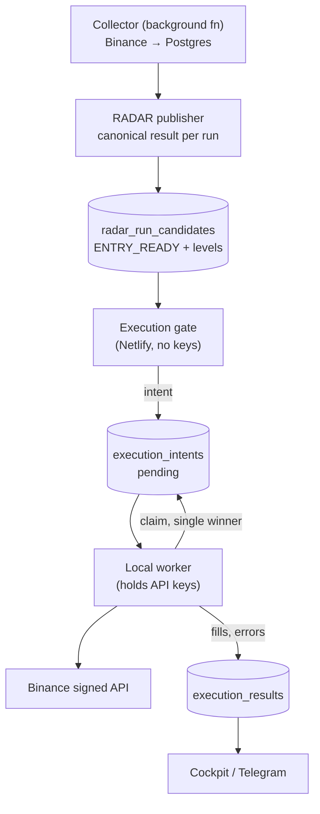

# Trade execution architecture — proposal

Status: **proposal, nothing built.** This describes how automated execution
should be assembled on top of what already exists. No part of it is wired up,
and every gate below is fail-closed by default.

## 1. What already exists

Most of the hard parts are in the repo already; the gap is the decision path and
the order lifecycle, not the plumbing.

| Piece | Where | State |
|---|---|---|
| Local worker holding API keys | `scripts/local-binance-worker.mjs` | Working, installed via the Windows/macOS scripts |
| Worker ↔ control protocol | `/api/bot/worker-heartbeat`, `worker-session`, `worker-command-ack`, `execution-result` | Working, with a retry queue for reports |
| Execution intents | `fleet.executionIntents[sessionId]`, statuses `pending` → `claimed` → cancelled | Working, single intent per session |
| Risk gate | `riskCheck()` in `bot.mjs` | Hard-wired to `dry_run`; refuses everything else |
| Position sizing by entry type | `positionSizeGuidance()` in `trading-radar.mjs` | Implements the v1 spec table (§10) |
| Canonical RADAR result | `radar_run_snapshots` / `radar_run_candidates` | Published every collector cycle |

**The keys never leave the local machine.** Netlify holds no trading
credentials and must never be able to place an order by itself. That property is
the foundation of everything below and must not be traded away for convenience.

## 2. The decision path



The decision comes from the **canonical RADAR result in Postgres**, never from a
browser session. This is the same correction already made for alerts: a decision
that can only be produced while someone has a tab open is not a system.

## 3. Intent lifecycle

An intent is a *request to trade*, not a trade. It must be safe to create twice
and impossible to execute twice.

```
proposed → pending → claimed → submitted → filled | partially_filled | rejected | expired
                          ↘ cancelled (superseded, invalidated, kill switch)
```

Rules that matter:

- **Idempotency key** = `runId + market + symbol + side`. The publisher produces
  one canonical result per run, so replaying a run can never open a second
  position. Today's `executionIntents[sessionId]` keyed by session cannot express
  this and needs to become its own table.
- **Single claim.** Claiming is a conditional update (`WHERE status='pending'`),
  so two workers racing produce one winner and one no-op — never two orders.
- **Expiry is mandatory.** The RADAR candidate carries `TIME_VALIDITY`; an intent
  that is not claimed within it expires rather than executing against a setup
  that no longer exists. An unexpiring intent is how a stale signal fires into a
  different market.
- **Invalidation cancels.** If a later run reports the symbol as `INVALIDATED`,
  or the market regime drops below the block threshold, a pending intent is
  cancelled before it can be claimed.

## 4. What the intent carries

Straight from the canonical candidate — the executor computes no trading
decisions of its own, it only translates:

```
symbol, market (spot|futures)
side: BUY
entryZone: { low, high }        → limit order placement
suggestedStop / invalidation    → protective stop
takeProfitCheckpoints[]         → TP ladder (§12)
positionSizePct                 → from positionSizeGuidance(status, confidence)
setupHash                       → detects "same setup, resent"
```

If any of these is missing the intent is **not created**. A trade with no stop is
not a smaller trade, it is an unbounded one.

## 5. Risk gates, in order

Each is fail-closed; a missing input reads as "block", never as "allow".

1. **Kill switch** — one env flag disables all execution, everywhere, instantly.
2. **Mode** — `dry_run` (default) records the intent and submits nothing;
   `paper` simulates fills; `live` submits. Today `riskCheck()` only permits
   `dry_run`; widening it should be a separate, reviewed change.
3. **Market regime** — `MARKET_REGIME_SCORE` below the block threshold refuses
   new longs regardless of the candidate (spec §13).
4. **Per-trade cap** — max notional per position, as an absolute figure, not a
   percentage of a balance the control plane cannot see.
5. **Portfolio caps** — max concurrent positions, max total exposure, max
   exposure per base asset. These need a positions table; without it the system
   cannot know it is about to open its fifth correlated long.
6. **Daily loss limit** — realised loss beyond a threshold stops new entries for
   the rest of the day.
7. **Cooldown per symbol** — mirrors the Telegram cooldown so one setup cannot
   re-enter repeatedly as it oscillates around a threshold.
8. **Data freshness** — the canonical run must be within the same bound the alert
   path uses; a stale run blocks execution.

## 6. Order placement

- **Entry**: limit order inside `entryZone`, never market. The spec's entries are
  zones precisely because chasing is the failure mode it is built to avoid.
- **Stop**: placed as a real exchange order immediately after the entry fills,
  not held in application memory. A stop that only exists in a process that can
  crash is not a stop.
- **Take profit**: ladder across TP1/TP2/TP3 with the size split declared up
  front.
- **Partial fills** are a first-class state: the stop is sized to the *filled*
  quantity, and the remainder is either kept working or cancelled explicitly.
- **Every order carries a client order id** derived from the intent id, so a
  reconnecting worker can recognise its own orders instead of duplicating them.

## 7. Reconciliation

The failure that matters is not a bad trade, it is a **position the system does
not know it has**. On every worker start and every heartbeat:

1. Fetch open orders and balances from the exchange.
2. Compare against the intents/positions the control plane believes are open.
3. Report any of: an exchange position with no matching intent, an intent marked
   filled with no exchange position, a stop that is missing for an open position.

Each discrepancy is surfaced loudly and blocks new entries until resolved. The
existing worker already reconciles balances after a buy (`local-binance-worker`
handles the case where free balance is less than executed quantity), so the
pattern is established.

## 8. What to build, in order

1. **`execution_intents` table** with the idempotency key and status machine —
   replacing the single-slot `fleet.executionIntents`.
2. **Gate function** that reads canonical ENTRY_READY candidates and proposes
   intents in `dry_run`. Observation only: it records what it *would* have done.
3. **Soak in dry_run** long enough to see the intent stream against real signals.
   This is where sizing and cooldowns get calibrated, before money is involved.
4. **Positions table + reconciliation loop** in the worker.
5. **Paper mode** — full lifecycle with simulated fills, exercising stops and TPs.
6. **Live mode**, behind its own flag, starting at a per-trade cap small enough
   that a total loss is uninteresting.

Steps 1–3 are safe to build now. Step 6 should not be enabled until 4 and 5 have
run without a single unexplained discrepancy.

## 9. Explicitly out of scope

- No leverage, no futures execution in v1 — spot only, where an unbounded loss is
  not possible.
- No martingale, averaging down, or position-size escalation after losses.
- No execution from any browser-driven state.
